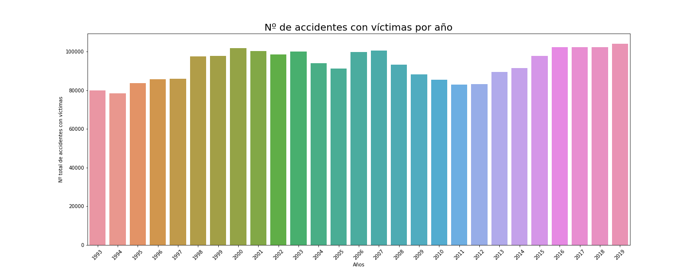
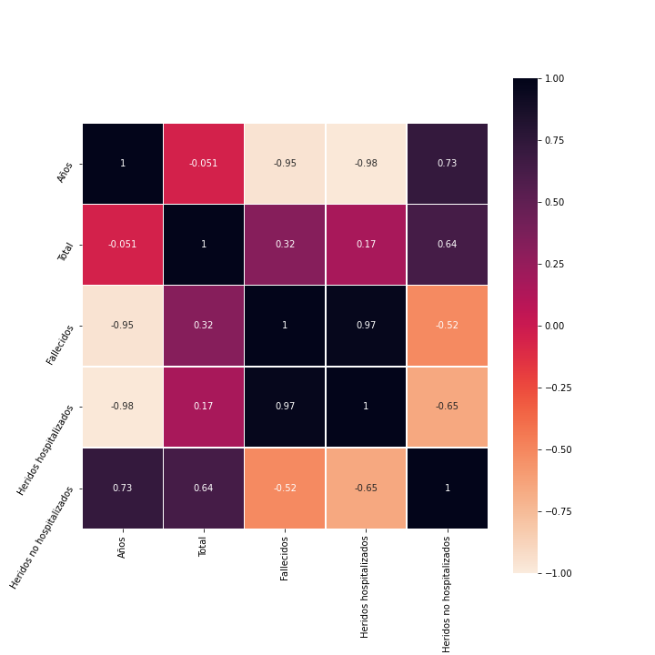
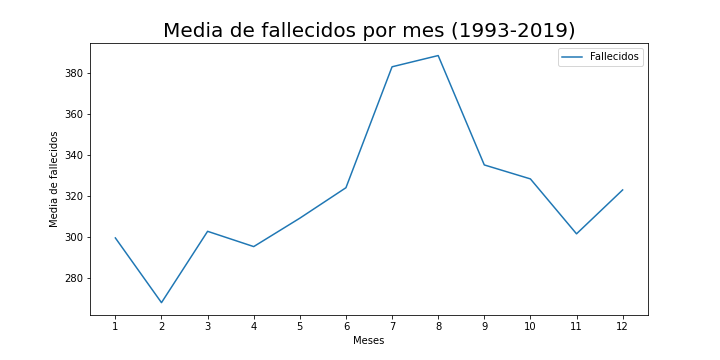
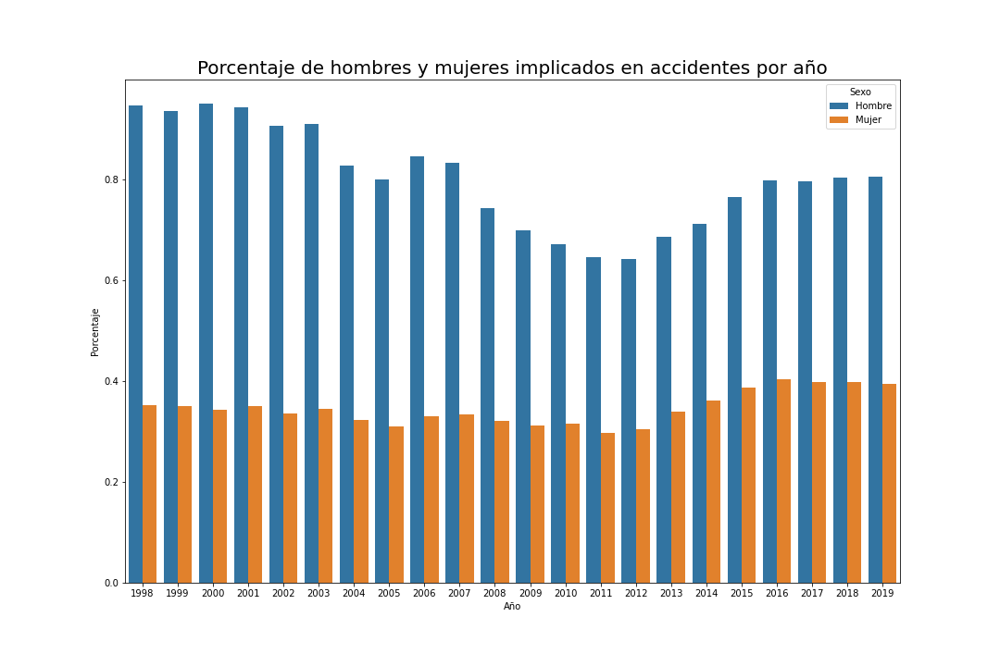
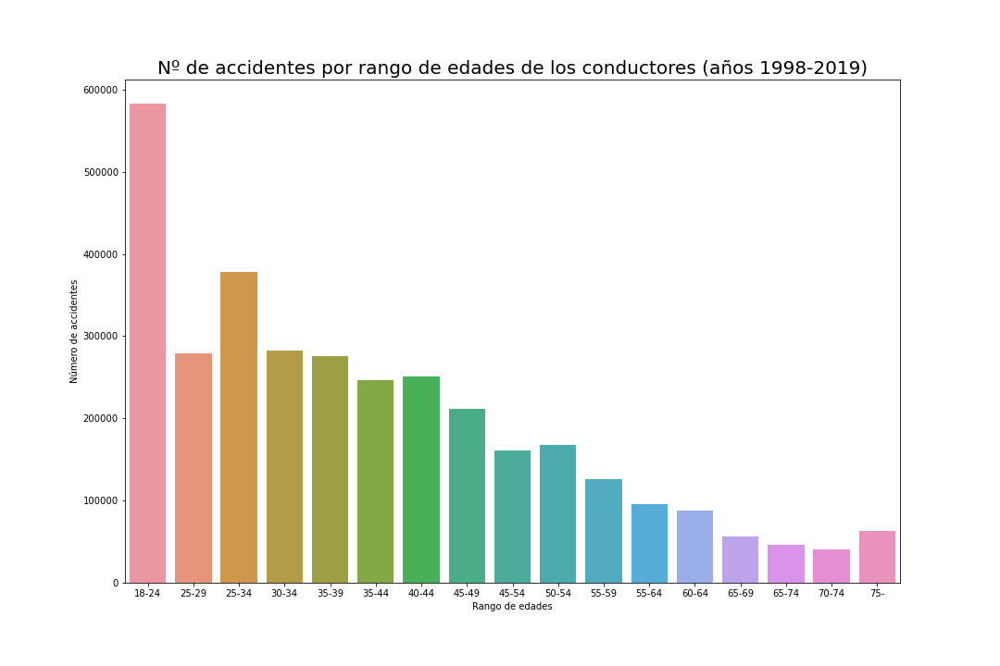

<h1 style='background:#006699; border:0; color:white; padding-top:15px; padding-bottom:15px; text-align: center;'>Proyecto EDA sobre accidentes de tráfico en España</h1> 

 

1. [Sobre el EDA](#eda)
2. [Datasets](#datasets)
3. [Estructura del proyecto EDA](#proyecto)
4. [Hipótesis y preguntas analizadas](#analisis)
   - [A lo largo de los años ha descendido el número de accidentes](#descensoaccidentes)
   - [A lo largo de los años ha descendido el número de fallecidos](#descensofallecidos)
   - [Las mujeres conducen con más precaución](#mujeres)
   - [Los jóvenes causan más accidentes](#jovenes)
   - [¿Provincia con más accidentes?](#provinciamasaccidentes)

&nbsp;

&nbsp;
   

<h2 style='background:#006699; border:0; color:white; padding-top:10px; padding-bottom:10px; padding-left:20px'>1. Sobre el EDA</h2>

Los accidentes mortales son una de las grandes asignaturas pendientes por resolver y la cifra de fallecidos un dato muy preocupante. No hay que olvidar que además de los fallecidos, otro tema preocupante son las victimas que quedan con secuelas graves para el resto de su vida, por ejemplo, una paraplejia.   
Por estas razones me he animado a hacer un EDA sobre los accidentes de tráfico en España. Al tratarse de una práctica y al disponer de poco tiempo para compaginar trabajo, Bootcamp y desarrollo de este EDA, no me he planteado un EDA muy ambicioso, pero al menos he querido marcarme unos objetivos mínimos para intentar demostrar que un EDA pueda ayudar a encontrar soluciones para disminuir el número de accidentes mortales de tráfico y el de fallecidos.   
Los objetivos que me he marcado en este EDA son:
-	Comprobar si a lo largo de los años ha descendido el número de accidentes y de fallecidos, para determinar si las acciones de prevención y seguridad vial de la DGT han sido efectivas
-	Validar que las mujeres conducen con más precaución (menos accidentes ocasionados por mujeres), para acabar con el mito discriminatorio de que las mujeres conducen peor que los hombres
-	Verificar que los jóvenes causan más accidentes con el fin de concienciarles para que sean más prudentes al volante
-	Además he incluido una pregunta, ¿en qué provincias se producen más accidentes?

[Ir a inicio](#top)

<h2 style='background:#006699; border:0; color:white; padding-top:10px; padding-bottom:10px; padding-left:20px'>2. Datasets</h2>

Los datasets utilizados en este Proyecto EDA se han creado a partir de información oficial publicada por la **(Dirección General de Tráfico)**, en adelante **DGT**, publicada en su página Web y que comprende los años desde 1993/98 a 2019.

Se ha utilizado varios tipos de información:
- [Tablas estadísticas](https://www.dgt.es/es/seguridad-vial/estadisticas-e-indicadores/accidentes-30dias/tablas-estadisticas/)   
   La información de esta sección es la relativa a los accidentes con víctimas, tanto en vías interurbanas como en vías urbanas. Las definiciones están recogidas en la [Orden INT/2223/2014, de 27 de octubre](https://www.boe.es/buscar/act.php?id=BOE-A-2014-12411), por la que se regula la comunicación de la información al Registro Nacional de Víctimas de Accidentes de Tráfico.

   Se consideran **accidentes de tráfico con víctimas** los que se producen, o tienen su origen en una de las vías o terrenos objeto de la legislación sobre tráfico, circulación de vehículos a motor y seguridad vial, cuentan con la implicación de al menos un vehículo en movimiento y a consecuencia de los mismos una o varias personas resultan muertas y/o heridas.

   Se considera **fallecido** toda persona que, como consecuencia de un accidente de tráfico, fallece en el acto o dentro de los siguientes treinta días. Se excluyen los casos confirmados de muertes naturales o en los que existan indicios de suicidio.

   Los datos que se muestran en esta sección son definitivos e integran la estadística de accidentes de tráfico con víctimas incluida en los Planes Estadísticos.

   Información de años desde 1998 a 2019.

- [Series históricas](https://www.dgt.es/es/seguridad-vial/estadisticas-e-indicadores/accidentes-30dias/series-historicas/)   
  La información de esta sección es la relativa a los accidentes con víctimas, tanto en vías interurbanas como en vías urbanas. Las definiciones están recogidas en la [Orden INT/2223/2014, de 27 de octubre](https://www.boe.es/buscar/act.php?id=BOE-A-2014-12411), por la que se regula la comunicación de la información al Registro Nacional de Víctimas de Accidentes de Tráfico.

  Se consideran **accidentes de tráfico con víctimas** los que se producen, o tienen su origen en una de las vías o terrenos objeto de la legislación sobre tráfico, circulación de vehículos a motor y seguridad vial, cuentan con la implicación de al menos un vehículo en movimiento y a consecuencia de los mismos una o varias personas resultan muertas y/o heridas.

  Se considera **fallecido** toda persona que, como consecuencia de un accidente de tráfico, fallece en el acto o dentro de los siguientes treinta días. Se excluyen los casos confirmados de muertes naturales o en los que existan indicios de suicidio.

  Los datos que se muestran en esta sección son definitivos e integran la estadística de accidentes de tráfico con víctimas incluida en los Planes Estadísticos.
  
  Información de años desde 1998 a 2019.

- [Series históricas del censo de conductores](https://www.dgt.es/es/seguridad-vial/estadisticas-e-indicadores/censo-conductores/series-historicas/)

**Requisitos:**  
- Para leer ficheros EXCEL he utilizado las suigientes librerías python:
  - lxml   
    https://anaconda.org/anaconda/lxml
  - xlrd   
    https://anaconda.org/anaconda/xlrd
  - openpyxl   
    https://anaconda.org/anaconda/openpyxl

[Ir a inicio](#top)

<h2 style='background:#006699; border:0; color:white; padding-top:10px; padding-bottom:10px; padding-left:20px'>3. Estructura del proyecto EDA</h2>

El proyecto EDA tiene la siguiente estructura de carpetas:
- src/: carpeta con todo el código
- src/data: carpeta con todos los archivos de datos utilizados en el analisis.
  - original: subcarpeta con los archivos originales.
  - clean: subcarpeta con los ficheros procesados y que se usan en el EDA. Ficheros en formato CSV.
- src/notebooks: carpeta con el notebook usado para procesar los archivos originales y generar los datasets a usar en el EDA.
- src/utils: contiene las clases y funciones auxiliares implementadas para el tratamiento de los datos originales.
- src/main.ipynb: notebook con el EDA

[Ir a inicio](#top)

<h2 style='background:#006699; border:0; color:white; padding-top:10px; padding-bottom:10px; padding-left:20px'>4. Hipótesis y preguntas analizadas</h2>

<h3 style='background:#006699; border:0; color:white; padding-top:10px; padding-bottom:10px; padding-left:20px'>A lo largo de los años ha descendido el número de accidentes</h2>
- **Datos**: histórico de accidentes entre 1993 y 2019   
  [Fichero CSV](src/data/clean/historico_accidentes_1993_2019.csv)
- Análisis
  

  La gráfica anterior no refleja un descenso de accidente con el paso de los año, por lo que la DGT debe  seguir trabajando acciones de prevención y seguridad vial.   

[Ir a inicio](#top)

<h3 style='background:#006699; border:0; color:white; padding-top:10px; padding-bottom:10px; padding-left:20px'>A lo largo de los años ha descendido el número de fallecidos</h2>
- **Datos**: histórico de fallecidos entre 1993 y 2019   
  [Fichero CSV](src/data/clean/historico_victimas_1993_2019.csv)
- Análisis
  

  Altas correlaciones:
  - Con el paso de los años disminuyen los fallecidos y los heridos hospitalizados
  - Al aumentar los años aumentan los heridos no hospitalizados
  - Al aumentar los heridos hospitalizados aumentan los fallecidos
  

  Media de fallecidos por mes:   
  

  El número de fallecidos y heridos hospitalizados ha disminuido a lo largo de los  años lo que parece indicar que las acciones de la DGT para una movilidad segura han funcionado. Sin embargo tiene que seguir trabajando en disminuir los fallecidos en los meses de verano.    

[Ir a inicio](#top)

<h3 style='background:#006699; border:0; color:white; padding-top:10px; padding-bottom:10px; padding-left:20px'>Las mujeres conducen con más precaución</h2>
- **Datos**: número de conductores implicados en accidentes y censo de conductores por sexo entre 1998 y 2019   
  [CSV con número de conductores implicados en accidentes](src/data/clean/conductores_por_edad_sexo_1998_2019.csv)   
  [CSV con el censo de conductores](src/data/clean/censo_conductores_1990_2019.csv)

- Análisis   
  Podemos prescindir de los registros de accidentes con conductores de sexo desconodido, porque el número es muy pequeño respecto los accidentes con sexo identificado.   
     
  *Porcentaje hombre*: nº conductores hombre implicados en accidentes / nº conductores hombre   
  *Porcentaje mujer*: nº conductores mujer implicados en accidentes / nº conductores mujer
  

  Con la gráfica anterior demostramos que las mujeres conducen con más precaución y podemos acabar con el mito discriminatorio de que  las mujeres conducen peor que los hombres.

[Ir a inicio](#top)

<h3 style='background:#006699; border:0; color:white; padding-top:10px; padding-bottom:10px; padding-left:20px'>Los jóvenes causan más accidentes</h2>
- **Datos**: número de conductores implicados en accidentes por sexo y edad  entre 1998 y 2019   
  [Fichero CSV](src/data/clean/conductores_por_edad_sexo_1998_2019.csv)
- Análisis  
  Considero como joven conductor al conductor con edad entre 18 (la edad mínima para obtener el carnet en España) y 24 años. Para el resto de edades establezco rango de 5 años, que es como vienen en los EXCEL de la DGT.  
  

   Según la gráfica anterior se puede dar por valida la hipótesis con cierta precaución, el rango de edad de conductores entre 18 y 24 años acumula un número de accidentes mayor que es resto de rangos de edad, pero hay que tener en cuanta que el rango que he elegido como conductor joven es de 7 años, 2 años más que el resto de rangos.   
   En la gráfica se observa además un descenso de número de accidentes a medida que aumenta la edad.
      
[Ir a inicio](#top)

<h3 style='background:#006699; border:0; color:white; padding-top:10px; padding-bottom:10px; padding-left:20px'>¿Provincia con más accidentes?</h2>
- **Datos**: número de conductores implicados en accidentes por sexo y edad  entre 1998 y 2019   
  [Fichero CSV](src/data/clean/historico_accidentes_x_provincia_1993_2019.csv)
- Análisis  
  
  

  Barcelona y Madrid son las provincias con más accidentes, por lo que se deben reforzar las acciones de prevención y seguridad vial en esas provincias.

[Ir a inicio](#top)
